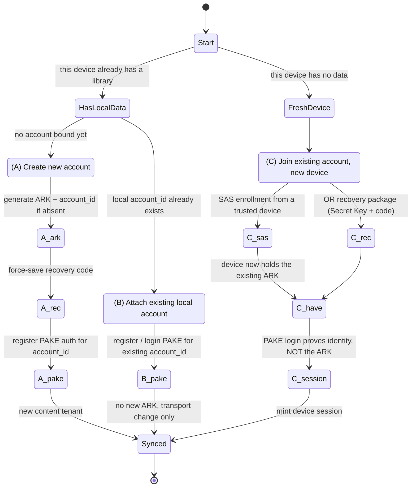

# ADR-029: Server Auth Identity vs. Content Keys — PAKE, Join Flows, and the Hosting/Licensing Boundary

**Status**: Accepted  
**Date**: 2026-07-27  
**Deciders**: kafkade

## Context

Everything shipped so far treats an account as **a client-side secret, not a
login**. Per ADR-024, the first device generates an **Account Root Key (ARK)** —
a 256-bit CSPRNG secret — plus an independent, random 128-bit `account_id` that
is **not derived from the ARK**. There is no email, no username, and no
server-side identity record beyond that opaque handle and whatever ciphertext
the account uploads. Every content key derives from the ARK
(`ACK_e = HKDF(ARK, "pergamon/v1/account-content" ‖ epoch)`, per-event keys,
convergent blob keys), and the ARK **never leaves a device except as
ciphertext**. A second device obtains the ARK only via **SAS enrollment from an
existing trusted device** or via a **recovery package** (a Secret Key /
passphrase or high-entropy recovery code) — never by logging in. The sync server
(ADR-026) is a **blind relay**: it stores ciphertext plus opaque onboarding
artifacts and performs no content-level authentication.

That model is complete for content confidentiality but does not answer a
different, product-driven requirement for **hosted** sync — whether self-hosted
by a user or operated as a managed service by kafkade: *"create an account on
the server"* and *"log in."* A managed multi-tenant service needs to prove that
a caller controls a given tenant so it can attach **quotas and billing**,
without ever gaining the ability to read content. The blind relay deliberately
lacks this. Bolting a naive login onto it invites three failure modes we must
foreclose in the design:

1. **Conflating auth with content encryption.** The ARK is random per ADR-024,
   so a "master password derives both the ARK and the login" scheme is not just
   undesirable — it is impossible without contradicting ADR-024.
2. **Collapsing the join flows.** "Create an account," "attach an existing local
   account to a server," and "join an existing account on a brand-new device"
   are three different state transitions with different key movements. A single
   "sign up / log in" path silently corrupts at least one of them.
3. **Mistaking a network boundary for a licensing boundary.** The AGPL server
   (ADR-008) exists specifically to prevent proprietary hosted offerings; adding
   a multi-tenant auth/quota/billing control plane raises a real AGPL §13
   question that a diagram alone does not resolve.

This ADR decides the **account and authentication model for hosted sync**. It
introduces an authentication plane **in front of / alongside** the blind relay;
it does **not** make the relay read content. It is the gate that unblocks the
hosted-sync work: WP-2 (#188), the WP-3 epic (#187) and its children, WP-5a
(#191), and WP-12 (#190), all tracked under epic #179. It does **not** change
ADR-024's content-key hierarchy, ADR-026's relay, or ADR-022's wire contract;
where this ADR cites them it is describing, not amending, them.

## Decision

### Decision 1 — One reviewed PAKE for the server auth identity

The hosted requirement is a **server authentication** need, distinct from
content encryption. We add a server-side auth identity backed by **exactly one
reviewed Password-Authenticated Key Exchange (PAKE)**.

- **Recommended protocol: OPAQUE**, an asymmetric PAKE (aPAKE) built on an
  Oblivious PRF (OPRF). Compared with SRP it is resistant to precomputation
  attacks and offers materially better verifier-compromise properties. The final
  choice is confirmed in a dedicated security design before implementation.
- **Do not ship "OPAQUE/SRP-style" as a spec.** SRP and OPAQUE differ in
  substance (verifier-compromise resistance, the OPRF, message flow). Name
  **one** protocol; the rest of this ADR assumes OPAQUE unless the security
  design supersedes it.
- The auth identity is derived from the **user's password** (optionally combined
  with a high-entropy **Secret Key**, 1Password-style, to raise the offline-guess
  floor). The server stores a **PAKE verifier only** — never the password, and
  nothing from which the password can be recovered offline without the OPRF.
- **Cryptographic independence is mandatory.** The auth secret and the ARK are
  **independent**. Because the ARK is a random secret (ADR-024), there is no
  master secret that derives *both* the ARK and the auth identity; any such
  scheme is rejected (see Consequences → rejected alternatives). Proving control
  of the auth identity to the server does **not** yield the ARK and cannot
  decrypt content.

### Decision 2 — Two-plane model: content keys vs. auth identity

The system has two independent planes. The content plane is unchanged from
ADR-024; the auth plane is new and never touches the ARK.

```text
Content plane  (ADR-024, UNCHANGED — the server never sees these)
  ARK = 256-bit random secret (generated on the first device)
    ├── account_stream_key  → ADR-022 entity_ref HMAC
    ├── ACK_e  (per key epoch e)
    │     ├── event keys       (AEAD-encrypt event bodies)
    │     └── convergent blob keys (content-addressed dedup)
    └── account_id = independent 128-bit random handle (NOT derived from ARK)
  The ARK reaches other devices ONLY via SAS enrollment or a recovery package.

Auth plane  (NEW — independent of the ARK)
  auth identity from user password (+ optional high-entropy Secret Key)
    ├── PAKE (OPAQUE) registration record → server stores a VERIFIER only,
    │      never the password
    └── per-device session / bearer credential minted after a successful PAKE,
           scoped to this account_id, authorizing push/pull for THAT tenant only
```

Properties and limits this buys us:

- The server can **prove a caller controls the account** — enough to enforce
  quotas and attach billing — while remaining unable to derive the ARK or read
  any content. **Content zero-access holds.**
- **Metadata privacy does not hold.** A managed multi-tenant server necessarily
  learns and correlates operational metadata (see the metadata section below).
  The correct framing is **"zero-access to content," not "zero-knowledge."**
- Session/bearer credentials are per-device and tenant-scoped: authenticating
  authorizes relay operations for one `account_id`; it never widens content
  access.

### Decision 3 — Three distinct join flows

The onboarding state machine models **three separate flows** and must not
collapse them. Each moves different material.

- **(A) Create a new account.** This device's local data *is* the account.
  Generate the ARK and `account_id` if not already present, **force-save a
  recovery code**, and register PAKE auth for that `account_id`. This mints a new
  content tenant.
- **(B) Attach an existing local account to a server.** This device already
  holds an `account_id` (used offline first). Bind *that* local `account_id` to a
  server after proving control by registering/logging in via PAKE for the
  existing `account_id`. **No new ARK is generated** — switching or adding a
  server is a transport change, not a crypto change.
- **(C) Join an existing account on a new device.** This device has **no data
  yet** and must **obtain the existing ARK** — via **SAS enrollment from a
  trusted device** or via the **recovery package** — and then mint a device
  session. A PAKE login here **proves identity to the server but does not hand
  the new device the random ARK.** A design that lets a fresh device
  auto-generate its own ARK and then "log in" would silently create a
  **different content account** under the same login — a footgun this ADR exists
  to prevent.



**Invariants that hold across every transition:**

- The ARK is generated on the **first device**, before any server exists.
- A new device **never invents an ARK**; flow (C) obtains the existing one via
  SAS enrollment or recovery.
- **Switching servers is a transport change, not a crypto change** — content
  keys are independent of the server auth identity.
- A server only ever receives **ciphertext** and opaque onboarding artifacts.

### Decision 4 — Password reset and content recovery are separate operations

These are two different operations with two different outcomes, and the UX must
say so bluntly.

- **Auth reset (forgot server password).** Handled by the chosen PAKE protocol's
  own reset/rotation design — a defined server-side reset flow — **not** a magic
  "PAKE recovery." Resetting the login **does not decrypt content**; it only
  restores the ability to authenticate to the relay.
- **Content recovery.** Available **only** via the ADR-024 recovery package
  (Secret Key + passphrase or recovery code), which is opt-in and off by default.
- **UX copy must be blunt, 1Password-style:** *"Resetting your server password
  does not decrypt your data; only your Secret Key / recovery code can."*
- **Prefer mandatory high-entropy recovery codes** over human-chosen passphrases,
  because the recovery blob is a ciphertext whose only guard is that secret;
  high-entropy codes blunt offline guessing of the blob (consistent with
  ADR-024's recovery-code option).

### Decision 5 — The AGPL hosting/licensing boundary

The multi-tenant auth/quota/billing **control plane** that the blind relay
intentionally lacks raises a licensing question. `pergamon-server` /
`pergamon-sync-server` are AGPL-3.0 **specifically to discourage proprietary
hosted offerings** (ADR-008), and AGPL §13 requires offering Corresponding
Source to remote users of a **modified** covered program. Two directions exist;
they are presented honestly, **not** as two clean options.

- **(A) Keep the auth/quota/billing layer AGPL and publish it. [RECOMMENDED]**
  Self-hosters get the same full server; kafkade competes on **operating** it.
  This hands competitors the same code, so the durable moat must be
  brand, clients, trust, distribution, operations, portability, and support —
  **not code exclusivity.**
- **(B) Put billing/identity in a separate control-plane service** that talks to
  an unmodified AGPL relay across a process/network boundary, potentially keeping
  that control plane closed. The "independent work" claim here is **fact-specific**
  and carries a real bait-and-switch perception risk for an open-source project.

Explicit cautions, recorded as part of the decision:

- **A network boundary is not automatically a clean licensing boundary.** Whether
  a separately deployed control plane is an "independent work" or a single
  combined derivative of the AGPL server is **fact-specific**.
- **Get legal counsel** before relying on direction (B); this ADR does not make a
  legal determination.
- **Consider dual-licensing / a CLA early.** These are only viable with the
  contributor copyright arrangements (a CLA or equivalent) in place before
  outside contributions accumulate.
- **Recommendation: direction (A).** The final legal determination requires
  counsel; the durable moat is **operational, not legal**.

### Zero-access to content, not zero-knowledge

A managed, multi-tenant server that enforces quotas and billing **necessarily**
learns and can correlate operational metadata. Confidentiality of *content*
holds; *metadata* privacy does not. The strongest new linkage is
**billing/auth identity ↔ `account_id`**, which the blind relay never had.

| Metadata the managed control plane learns / correlates | Source / why |
|---------------------------------------------------------|--------------|
| Billing & auth identity ↔ `account_id` | PAKE registration + payment; the strongest *new* linkage vs. the blind relay |
| IP address, request timing & cadence | Every authenticated request; inherent to serving traffic |
| Device count and `device_id`s | Per-device sessions and device records (ADR-024) |
| Event and blob **counts and sizes** | Quotas require measuring storage/activity (ADR-022 envelopes/blobs) |
| Key epochs | Visible in envelope headers (`key_epoch`, ADR-022/024) |
| Stable `entity_ref` equality | Server can group events per blinded entity (ADR-022 blinding) |
| Subscription / payment metadata | Billing records |

Quota enforcement uses **exactly** this size/activity metadata: it is
**compatible with content confidentiality but incompatible with metadata
privacy.** The product must therefore ship a **metadata inventory**, a
**retention policy**, and a **traffic-log policy** for the managed service,
tracked under WP-13. Self-hosters who run the relay behind their own
infrastructure retain more metadata privacy by construction.

### Five distinct surfaces

An authenticated multi-tenant relay does **not** contradict ADR-017, which
governs a *separate*, plaintext, single-user web app. Keep these five surfaces
distinct to avoid the ADR-017 confusion:

1. **Local clients** — CLI/TUI, iOS, and web clients holding the ARK; the
   canonical, plaintext local store.
2. **Self-hosted plaintext single-user web app** (ADR-016/ADR-017) — one owner,
   one password, server-side sessions; sees plaintext because it *is* the user's
   own machine.
3. **Blind sync relay** (ADR-026) — ciphertext + opaque onboarding artifacts
   only; no content auth.
4. **Managed auth/billing control plane (this ADR)** — proves tenant control via
   PAKE for quotas/billing; still zero-access to content.
5. **Future hosted zero-access browser client** — a WASM client that holds keys
   in the browser and speaks to surfaces 3/4 without the server ever seeing
   plaintext (future ADR-031 / WP-5a, ADR-016 WASM boundary).

## Consequences

### Positive

- **Hosted sync is unblocked** with a clean separation: the server can bill and
  meter without ever being able to read content.
- **Content zero-access is preserved.** The ARK stays random and independent
  (ADR-024); no server compromise yields plaintext.
- **The join flows are unambiguous**, foreclosing the "fresh device invents a new
  ARK and logs in" footgun that would silently fork a user's library.
- **Reset vs. recovery is honest and legible**, matching the 1Password mental
  model users already understand.
- **The licensing risk is on the record** with a recommended direction and an
  explicit call for counsel, rather than discovered late.

### Negative / trade-offs

- **Metadata privacy is reduced** for the managed service: billing identity is
  linkable to `account_id`, and quotas require measuring sizes and activity.
  This is inherent, not incidental, and is mitigated only by policy and by the
  self-hosting option.
- **Two authentication concepts now coexist** (content keys and server auth),
  which is more surface area to explain and to implement correctly; the UX must
  work hard to keep them from being conflated.
- **The licensing boundary is unresolved pending counsel.** Direction (B) cannot
  be relied upon until a fact-specific legal review completes; dual-licensing/CLA
  groundwork must precede any such move.
- **OPAQUE is a non-trivial dependency** requiring a reviewed implementation and a
  dedicated security design before it ships.

### Neutral / rejected alternatives

- **Rejected: a single master secret that derives both the ARK and the auth
  identity.** This is incompatible with ADR-024, where the ARK is a random
  secret; it is called out explicitly so no future design "simplifies" toward it.
- **Rejected: shipping "OPAQUE/SRP-style" as an unresolved spec.** SRP and OPAQUE
  differ materially; the ADR commits to naming one (recommended OPAQUE).
- **Rejected: making the relay content-aware to do auth.** Auth lives in a plane
  *in front of / alongside* the relay; the relay stays blind (ADR-026).
- **Neutral: self-hosting.** Self-hosters may run the relay and (if published)
  the control plane themselves, trading managed convenience for maximal metadata
  privacy.

## References

- [ADR-008: Licensing — Apache-2.0 + AGPL-3.0](008-licensing-apache-20-agpl-30.md)
  — the AGPL rationale and the §13 hosted-service concern behind Decision 5.
- [ADR-016: Web Architecture and WASM Boundary](016-web-architecture-and-wasm-boundary.md)
  — the WASM boundary a future hosted zero-access browser client would use.
- [ADR-017: Auth and Session Model for Web App](017-auth-session-model.md)
  — the single-user plaintext web app; surface (2) in the five-surfaces note.
- [ADR-022: Sync Protocol and Envelope Model](022-sync-protocol-and-envelope-model.md)
  — envelope fields, `entity_ref` blinding, and the size/epoch metadata quotas measure.
- [ADR-024: Device Onboarding and Key Lifecycle](024-device-onboarding-and-key-lifecycle.md)
  — the ARK, `account_id`, SAS enrollment, and recovery this ADR builds on and does not change.
- [ADR-026: Sync Server Deployment](026-sync-server-deployment.md)
  — the blind relay this ADR authenticates in front of, without making it read content.
- [ADR-030: Sync Trust Hardening](030-sync-trust-hardening.md)
  — event authenticity/authorship on the content plane, complementary to server auth.
- Epic #179 — hosted-sync program. This ADR is the gate that unblocks WP-2 (#188),
  the WP-3 epic (#187) and children, WP-5a (#191), and WP-12 (#190); the metadata
  inventory/retention/traffic-log policy is tracked under WP-13.
