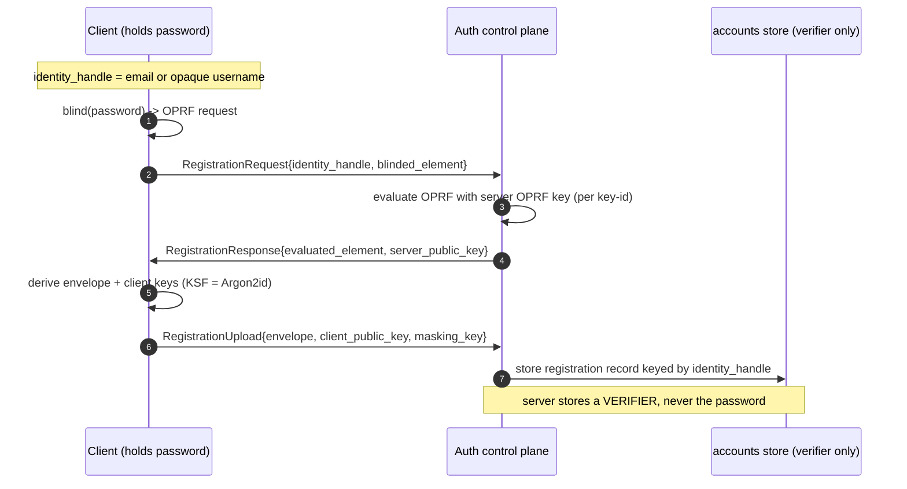
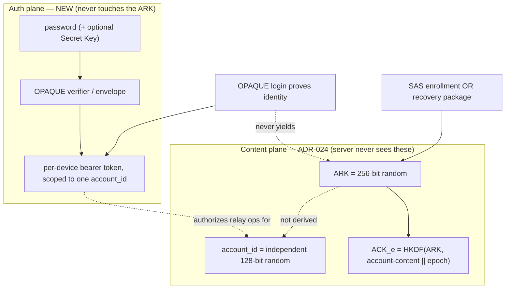
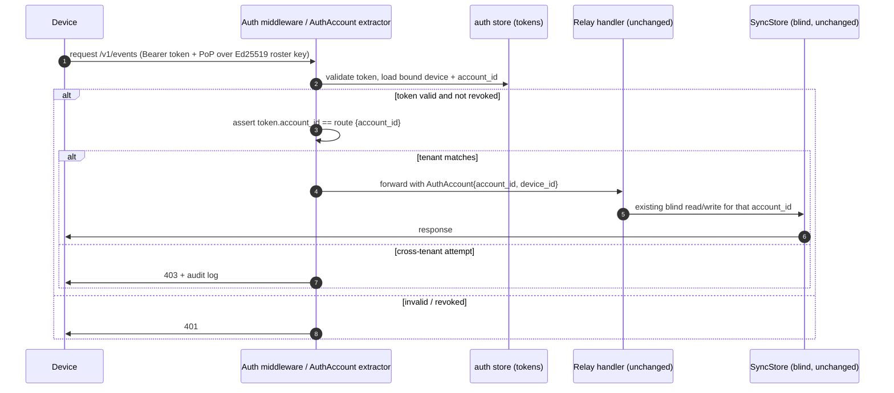
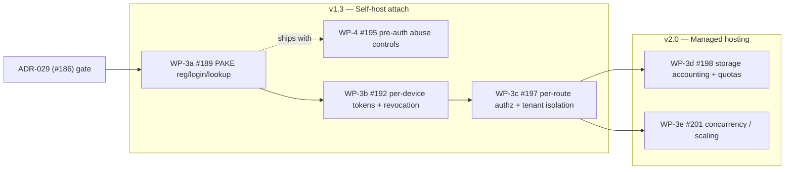

# Hosted Auth Control Plane — OPAQUE Security Design and Multi-Tenant Decomposition

**Status:** Draft — security design (external review pending) ·
**Date:** 2026-07-27 ·
**Epic:** [#187](https://github.com/kafkade/pergamon/issues/187) ·
**Children:** [#189](https://github.com/kafkade/pergamon/issues/189) ·
[#195](https://github.com/kafkade/pergamon/issues/195) ·
[#192](https://github.com/kafkade/pergamon/issues/192) ·
[#197](https://github.com/kafkade/pergamon/issues/197) ·
[#198](https://github.com/kafkade/pergamon/issues/198) ·
[#201](https://github.com/kafkade/pergamon/issues/201) ·
**Implements:** [ADR-029](../adr/029-server-auth-identity-and-join-flows.md) ·
**Builds on (unchanged):** [ADR-024](../adr/024-device-onboarding-and-key-lifecycle.md),
[ADR-026](../adr/026-sync-server-deployment.md),
[ADR-030](../adr/030-sync-trust-hardening.md)

## Scope and status

[ADR-029](../adr/029-server-auth-identity-and-join-flows.md) ratified the
account and authentication model for hosted sync. Decision 1 selects **exactly
one reviewed PAKE (OPAQUE)** and requires that the choice "be confirmed in a
dedicated security design before implementation." **This document is that
security design**, and it also refines the decomposition of epic
[#187](https://github.com/kafkade/pergamon/issues/187) into its child work
packages.

What this document is:

- The OPAQUE security design that gates WP-3a
  ([#189](https://github.com/kafkade/pergamon/issues/189)).
- The multi-tenant control-plane architecture that authenticates *in front of*
  the existing blind relay without making the relay read content.
- A refined sequencing/decomposition proposal for
  [#187](https://github.com/kafkade/pergamon/issues/187).

What this document is **not**: it writes no code, adds no dependency, and does
not amend [ADR-024](../adr/024-device-onboarding-and-key-lifecycle.md)'s content
key hierarchy, [ADR-026](../adr/026-sync-server-deployment.md)'s relay, or
[ADR-022](../adr/022-sync-protocol-and-envelope-model.md)'s wire contract. It
deliberately excludes pricing/business strategy; the metadata inventory,
retention, and traffic-log policy remain tracked under WP-13. Values marked
**(to confirm)** are asserted here but must be re-verified against upstream
before WP-3a starts.

## Part 1 — OPAQUE authentication security design

### 1.1 Why OPAQUE, restated

The hosted requirement is a **server authentication** need — prove a caller
controls a tenant so the operator can attach quotas and billing — that is
cryptographically distinct from content encryption. Per
[ADR-024](../adr/024-device-onboarding-and-key-lifecycle.md) the Account Root
Key (ARK) is a 256-bit random secret and `account_id` is an independent random
128-bit handle *not derived from the ARK*, so no "master password derives both
the ARK and the login" scheme is possible. OPAQUE, an asymmetric PAKE (aPAKE)
built on an Oblivious PRF (OPRF), lets the server hold a **verifier only**,
never the password, and is resistant to pre-computation attacks with materially
better verifier-compromise properties than SRP.

### 1.2 Library selection: `opaque-ke`

#### Verified facts

The following were checked against crates.io and the upstream repository on
2026-07-27:

| Property | Finding |
|---|---|
| Crate | `opaque-ke` — `facebook/opaque-ke` |
| Latest stable | `4.0.1` (2025-11-03); `4.1.0-pre.2` pre-release (2026-03-27) |
| Spec alignment | Implementation states it is **based on RFC 9807** (the published OPAQUE aPAKE RFC; the `draft-irtf-cfrg-opaque` CFRG draft was finalized as RFC 9807) |
| Audit | **NCC Group, June 2021**, sponsored by WhatsApp for E2EE backups; found issues in `v0.5.0`, fixed in `v1.2.0`; public report |
| License | Dual MIT / Apache-2.0 — compatible with the AGPL-3.0 server crate |
| MSRV | Rust **1.87** |
| Adoption | ~522k downloads; WASM packages (`@serenity-kit/opaque`) and React Native bindings exist downstream |

#### Assessment

- **Alignment is strong.** Tracking a published RFC (9807) rather than a moving
  draft is a maturity signal and eases interop with non-Rust clients (a future
  WASM/browser client, ADR-016/ADR-029 surface 5).
- **The audit is real but stale for our purposes.** The 2021 NCC Group review
  covered the `v0.x`/`v1.x` line; the current API is `v4.x`, several major
  versions and years newer. The audit raises confidence in the design lineage,
  **not** in the exact code we would ship. Treat "audited" as "audited once, on
  an old version" — **(to confirm)** whether any re-audit covers `v3.x`/`v4.x`.
- **Cipher-suite choice is a design decision, not a default.** OPAQUE is
  parameterized by an OPRF group, a KSF (key-stretching function), a KEM/AKE
  group, and a hash. To stay inside the existing
  [ADR-024](../adr/024-device-onboarding-and-key-lifecycle.md) toolbox we should
  prefer a Ristretto255/X25519 + Argon2id + SHA-512 suite — **(to confirm)**
  against the exact type parameters `opaque-ke 4.x` exposes and their
  `no_std`/WASM support.

#### Recommendation and review gate

**Recommend adopting `opaque-ke` (pinned to the latest audited-lineage stable,
`4.0.1` at time of writing) as the single PAKE for WP-3a**, subject to a
hard gate:

> **WP-3a MUST NOT ship until an independent external security reviewer has
> confirmed the properties in [§1.11](#111-external-review-checklist) against the
> exact crate version, cipher suite, and integration code we intend to
> deploy.** The 2021 audit does not satisfy this gate on its own.

Rejected alternatives: rolling our own OPAQUE (unacceptable for a novel-crypto
footgun), and shipping "OPAQUE/SRP-style" as an unresolved spec (explicitly
rejected by [ADR-029](../adr/029-server-auth-identity-and-join-flows.md)).

### 1.3 Registration flow

Registration runs once per account (join flow **A**) or when binding an
existing local account to a server (join flow **B**). The client's password
(optionally combined with a high-entropy Secret Key, see
[§4](#part-4--open-questions-for-the-maintainer)) never leaves the device; the
OPRF blinds it so the server contributes its secret without learning the input.



The server never sees the password or any value from which it can be recovered
offline without also running the OPRF (which requires the server OPRF key).

### 1.4 Login and AKE flow

Login is the standard OPAQUE three-message authenticated key exchange (KE1/KE2/
KE3). Success proves the client knows the password **and** mutually
authenticates the server; it yields a shared session key that the control plane
uses to mint a per-device bearer credential (Part 2). It never yields the ARK.

```mermaid
sequenceDiagram
    autonumber
    participant C as Client
    participant S as Auth control plane
    participant DB as accounts store
    C->>S: KE1{identity_handle, blinded_element, client_nonce, client_keyshare}
    S->>DB: look up registration record (uniform on miss, see §1.6)
    S->>S: evaluate OPRF; assemble masked envelope
    S->>C: KE2{evaluated_element, masked_response, server_keyshare, server_mac}
    C->>C: recover envelope with password; verify server_mac
    alt server authenticated
        C->>S: KE3{client_mac}
        S->>S: verify client_mac -> session established
        S->>C: device bearer token (bound to Ed25519 roster key, Part 2)
    else server_mac invalid
        C->>C: abort (server not authenticated)
    end
```

### 1.5 What the server persists (verifier, not password)

Registration produces an OPAQUE **registration record** — the client public key,
a masking key, and the **envelope** (an authenticated encryption of the client's
long-term keys under a key derived from the OPRF output). This record is the
verifier: it authenticates a login but is **not** the password and cannot be
brute-forced *online* because every guess must pass through the server-side
OPRF, which is rate-limited ([§1.7](#17-online-guessing-throttling)). An
attacker who steals the record offline still faces an OPRF-gated,
Argon2id-stretched guess per candidate password
([§1.10](#110-threat-model)).

**Where it lives — a hard separation.** The verifier lives in a **new `accounts`
table in a separate auth store/module**, never co-mingled with the blind-relay
content tables (`events`, `blobs`, `device_records`, `wrapped_bundles`,
`attestations`, `recovery_blobs`). Concretely, a new `auth` module owns its own
schema (and, per [§2.3](#23-data-model-additions-and-where-they-live),
preferably its own database file/connection), so the relay's content store stays
exactly as blind as it is today:

```text
auth store (NEW, control plane)        content store (UNCHANGED, blind relay)
  accounts(identity_handle,              events(account_id, server_seq, ...)
           opaque_record, envelope,      blobs(account_id, ct_hash, ...)
           oprf_key_id, created_at)      device_records(account_id, device_id, ...)
  account_map(identity_handle           wrapped_bundles(...)
              -> account_id)             attestations(...)
  sessions/tokens(...)                   recovery_blobs(...)
  quota/accounting(...)
```

### 1.6 Account-lookup privacy

An unauthenticated caller must learn **nothing** about whether an
`identity_handle` exists. This foreclosures an account-existence oracle that
would otherwise leak the account roster.

- **Uniform responses.** Registration-lookup and login must return
  indistinguishable responses for existing and non-existing identities. OPAQUE
  supports this: on an unknown identity the server derives a deterministic
  *fake* registration record (a pseudo-random envelope seeded by a server secret
  keyed on the identity) and runs the full KE2 path, so the wire response and
  the failure mode look identical to a real-but-wrong-password attempt.
- **Constant-ish timing.** The KSF/OPRF work must run on the miss path too, so
  timing does not distinguish "no such account" from "wrong password." Treat
  timing side channels as in-scope for the external review.
- **Decoupled identifiers.** The login `identity_handle` (email or opaque
  username) is **not** the content-plane `account_id`. The auth store maps
  `identity_handle -> account_id` internally; the mapping is never exposed to
  unauthenticated callers, and content routes continue to key on the opaque
  `account_id` only.

### 1.7 Online-guessing throttling

Because the OPRF makes offline guessing expensive, the dominant residual risk is
**online** guessing. Throttling is layered and coordinated with WP-4
([#195](https://github.com/kafkade/pergamon/issues/195)), which ships *with*
WP-3a:

- **Per-identity** exponential backoff and lockout on repeated login failures
  for one `identity_handle`.
- **Per-IP / per-subnet** rate limiting on registration and login to blunt
  spraying across many identities (WP-4).
- **Global pre-auth caps** on request rate and body size so an unauthenticated
  flood cannot exhaust the relay (WP-4).
- **Lockout policy:** escalating delay rather than hard permanent lockout, to
  avoid a trivial account-denial vector; alert/audit on sustained failure.

Division of labour: WP-3a owns the *per-identity* auth-failure counter (it needs
the verifier lookup); WP-4 owns the *transport-level* (per-IP, body-cap,
DoS-isolation) controls that sit in front of every route, authenticated or not.

### 1.8 OPRF server-key management and rotation

The server holds a long-lived **OPRF key** used to evaluate every registration
and login for its accounts. Its management is security-critical:

- **Storage.** The OPRF key is a server secret (comparable sensitivity to a TLS
  private key). It must live outside the database in a secret manager / KMS /
  env-injected secret, never in the `accounts` table next to the verifiers it
  protects. Compromise of the OPRF key downgrades stolen verifiers toward
  ordinary offline-guessable hashes, so it is defense-in-depth for the
  verifier-DB-theft case.
- **Key identifier.** Each account's registration record records the
  `oprf_key_id` it was created under, so multiple keys can coexist during
  rotation.
- **Rotation.** OPAQUE does not allow the server to unilaterally re-key an
  existing verifier (it never has the password). A rotation therefore means:
  stand up a new `oprf_key_id`, register new accounts under it, and **migrate
  existing accounts opportunistically at next successful login** (the client
  re-runs registration transparently after authenticating). Keep the old key
  available until migration completes, then retire it. Document this as a
  multi-week drain, not an instantaneous flip.

### 1.9 The auth-plane ⟂ content-plane invariant

The single most important property: **passing OPAQUE login proves identity to
the server but never hands the random ARK to a new device.** The ARK reaches a
new device only via SAS enrollment from a trusted device or via the
[ADR-024](../adr/024-device-onboarding-and-key-lifecycle.md) recovery package.
The server never sees the ARK in any form except ciphertext it cannot open.



A fresh device that authenticated but has **not** completed SAS enrollment or
recovery holds a valid session token yet **cannot decrypt anything** — exactly
the [ADR-029](../adr/029-server-auth-identity-and-join-flows.md) join-flow **C**
guarantee that prevents a device from inventing its own ARK and silently forking
the library.

### 1.10 Threat model

| Adversary / event | What they can attempt | Mitigation | What it buys |
|---|---|---|---|
| Honest-but-curious server | Read verifiers, correlate metadata | Verifier is not the password; content stays E2EE (ARK never on server) | Zero-access to content; metadata privacy explicitly **not** claimed (ADR-029) |
| Hostile server (active) | Serve forged KE2, swap keys, re-target | OPAQUE mutual auth (server_mac); ARK never transits; enrollment protected by out-of-band SAS (ADR-024) | Client detects an inauthentic server; a login cannot be turned into content access |
| Offline verifier-DB theft | Brute-force passwords from stolen `accounts` rows | OPRF-gated guesses (need server OPRF key, stored separately) + Argon2id stretching | Each guess is expensive and, without the OPRF key, infeasible at scale |
| Active MITM on the wire | Intercept/alter login | TLS at the edge **plus** OPAQUE's own mutual auth (belt and suspenders) | Compromised TLS alone does not yield the password or a session |
| Replay | Resend a captured login/token | Per-session nonces in KE1/KE3; short-lived, device-bound tokens with server-side revocation (Part 2) | Captured transcripts are not replayable into a new session |
| Account-existence probing | Enumerate the account roster | Uniform responses + constant-ish timing + blind lookups (§1.6) | No existence oracle for unauthenticated callers |
| Online password guessing | Spray logins | Per-identity backoff/lockout + per-IP caps (§1.7 / WP-4) | Online guessing throttled to impracticality |

Content confidentiality holds against **every** row above. Metadata privacy does
not, by construction, for a managed multi-tenant operator (ADR-029 "zero-access
to content, not zero-knowledge").

### 1.11 External review checklist

Before WP-3a ships, an independent reviewer must confirm:

1. The chosen `opaque-ke` version, cipher suite, and KSF parameters match the
   RFC 9807 profile we claim, with no downgraded parameters.
2. The registration record stored is a verifier/envelope only — no password, no
   password-equivalent — and the schema lives in the separate auth store.
3. The miss path (unknown identity) is **byte-for-byte and timing-wise**
   indistinguishable from a wrong-password attempt (no existence oracle).
4. The OPRF server key is stored outside the verifier database and its rotation
   procedure is sound.
5. Online-guess throttling (per-identity, per-IP) and lockout cannot be bypassed
   and does not create a trivial denial-of-service against a target account.
6. A successful login yields **only** a tenant-scoped session token and **never**
   any path to the ARK or plaintext content.
7. Session tokens are device-bound (proof-of-possession), short-lived, and
   server-revocable; replay of a captured transcript fails.
8. TLS-termination assumptions at the edge are documented and the OPAQUE layer
   is safe even against a compromised TLS terminator.

## Part 2 — Multi-tenant control-plane architecture

### 2.1 Where authentication sits

Today `crates/pergamon-sync-server/src/routes/mod.rs` wires every route with
**no middleware and no auth layer**, and each `{account_id}` path parameter is
taken from the URL with **no ownership check** — correct for a single-account
blind relay, unsafe for multi-tenant hosting. The control plane adds an **axum
middleware/extractor in front of the existing handlers** that (1) resolves the
authenticated account from a per-device bearer token and (2) enforces that the
token's account equals the `{account_id}` the route targets. The relay handlers
and the blind content store are otherwise unchanged.



Every `{account_id}` route (`/v1/events`, `/v1/blobs/*`, `/v1/devices/*`,
`/v1/wraps/*`, `/v1/attestations/*`, `/v1/recovery/*`) is placed behind this
extractor; `/health` stays open. WP-3c
([#197](https://github.com/kafkade/pergamon/issues/197)) is the hard boundary
that makes this isolation exhaustive and audited.

### 2.2 Per-device credential model

After a successful OPAQUE login the control plane mints a **per-device session /
bearer token** scoped to exactly one `account_id`:

- **Bound to the device's Ed25519 roster key.** Token issuance requires a
  proof-of-possession over the device's
  [ADR-024](../adr/024-device-onboarding-and-key-lifecycle.md) Ed25519 key (the
  same key that signs the device record already stored in `device_records`), so
  a stolen bearer token alone — without the device private key — is materially
  weaker. This ties WP-3b
  ([#192](https://github.com/kafkade/pergamon/issues/192)) to the existing
  device roster rather than inventing a parallel identity.
- **Lifecycle.** Short-lived access tokens plus a refresh path; refresh also
  requires the device PoP. Tokens carry the `account_id`, `device_id`, an
  expiry, and a token id for revocation.
- **Revocation.** A server-side revocation list (or short TTL + refresh denial)
  rejects a revoked device immediately; revoking a device here is the
  server-auth complement to the content-plane revocation/epoch-rotation already
  specified in [ADR-024](../adr/024-device-onboarding-and-key-lifecycle.md) and
  hardened in [ADR-030](../adr/030-sync-trust-hardening.md). The two are
  independent: revoking server access does not rotate content epochs, and vice
  versa; a full device off-boarding does both.

### 2.3 Data-model additions and where they live

New state, all in the **separate auth module** (recommended: its own database
file, or at minimum its own schema/connection), so the content tables stay blind
and the AGPL/content-blindness properties are preserved:

| Table (auth store) | Purpose | Notes |
|---|---|---|
| `accounts` | OPAQUE registration record | `identity_handle`, `opaque_record`, `envelope`, `oprf_key_id`, `created_at` |
| `account_map` | `identity_handle` → `account_id` | internal only; never exposed to unauthenticated callers |
| `sessions` / `tokens` | per-device bearer/refresh tokens | `token_id`, `account_id`, `device_id`, `expires_at`, `revoked_at` |
| `auth_failures` | per-identity throttling counters | feeds §1.7 backoff/lockout |
| `quota` / `accounting` | per-tenant size + object counts | WP-3d; measured on ciphertext size only |

The blind content store (`events`, `blobs`, `device_records`,
`wrapped_bundles`, `attestations`, `recovery_blobs`) gains **no new content
columns**; the only coupling is the middleware asserting the authenticated
`account_id` before a handler touches it.

### 2.4 Concurrency and scaling (`state.rs`)

`crates/pergamon-sync-server/src/state.rs` today is a single global
`Arc<Mutex<SyncStore>>` — one process-wide lock serializing every tenant's every
request. That is the WP-3e
([#201](https://github.com/kafkade/pergamon/issues/201)) bottleneck. The target:

- Replace the single mutex with a **connection pool** (e.g. per-request checkout)
  and enable **SQLite WAL** so readers do not block the writer; a single writer
  still serializes writes, so document the write-path ceiling honestly.
- Consider **per-tenant connection affinity or sharding** so one heavy tenant
  cannot stall others, aligning with the WP-4 storage-DoS-isolation goal.
- Define the **horizontal-scaling story** (read replicas / sharding by
  `account_id` / a future non-SQLite backend) and back the change with a load
  test demonstrating concurrent tenants no longer serialize. WAL sidecar files
  (`-wal`, `-shm`) change the ADR-026 "no WAL sidecars under normal operation"
  note — flag that for the deployment docs.

### 2.5 AGPL and content-blindness boundary

The auth/quota/billing control plane stays **AGPL-3.0** per
[ADR-029](../adr/029-server-auth-identity-and-join-flows.md) Decision 5
(recommended direction A: keep it AGPL and publish it). Adding authentication
does **not** make the relay content-aware: the middleware inspects tokens and
`account_id`s (metadata the operator already necessarily learns), never
ciphertext. The five-surfaces distinction from ADR-029 is preserved — this is
surface 4 (managed auth/billing control plane), still zero-access to content.
Any future move toward a separate closed control plane (direction B) is
fact-specific and gated on legal counsel; nothing in this design depends on it.

## Part 3 — Epic decomposition and sequencing

### 3.1 Work-package refinement table

| WP | Issue | Adds / changes | Acceptance (crisp) | Depends on | Release |
|---|---|---|---|---|---|
| WP-3a | [#189](https://github.com/kafkade/pergamon/issues/189) | New `auth` module + `accounts`/`account_map` tables; OPAQUE registration/login/lookup endpoints; per-identity failure counter | Register/login via OPAQUE storing a verifier only; lookup leaks no account existence; per-identity throttling live; external-review checklist (§1.11) signed off | ADR-029 (#186) | v1.3 |
| WP-4 | [#195](https://github.com/kafkade/pergamon/issues/195) | Pre-auth transport controls: per-IP rate limit, body/upload caps, storage-DoS isolation layer | Pre-auth rate limiting on register/login/upload; configurable body caps; one tenant/IP cannot degrade others | #189 (**ships with**) | v1.3 |
| WP-3b | [#192](https://github.com/kafkade/pergamon/issues/192) | `sessions`/`tokens` tables; token mint/refresh/revoke bound to Ed25519 device PoP | Per-device tokens scoped to one account, issuance tied to device-key PoP; refresh + revocation; revoked device rejected | #189 | v1.3 |
| WP-3c | [#197](https://github.com/kafkade/pergamon/issues/197) | Auth middleware / `AuthAccount` extractor on **every** `{account_id}` route; cross-tenant rejection + audit | Every mutating/reading route checks authenticated account vs target `account_id`; cross-tenant rejected + audited; isolation tests on all routes | #192 | v1.3 |
| WP-3d | [#198](https://github.com/kafkade/pergamon/issues/198) | `quota`/`accounting` tables; per-tenant ciphertext size/count metering + enforcement | Per-tenant storage + object-count accounting; enforceable quotas with clear over-quota behavior; metrics exposed for billing | #197 | v2.0 |
| WP-3e | [#201](https://github.com/kafkade/pergamon/issues/201) | Replace `Arc<Mutex<SyncStore>>` with pool/per-tenant; WAL; scaling strategy | Concurrent tenants no longer serialize; documented scaling approach; load test shows improvement | #197 | v2.0 |

**Milestone correction (flagged):** the child issue bodies place **WP-3c
([#197](https://github.com/kafkade/pergamon/issues/197)) in `v1.3 — Self-host
attach`**, not `v2.0`. Only WP-3d (#198) and WP-3e (#201) are `v2.0 — Managed
hosting`. The v1.3 set is therefore #189 + #195 + #192 **+ #197**; the v2.0 set
is #198 + #201. (The scoping brief assumed #197 was v2.0; the issues say
otherwise.) WP-3c landing in v1.3 makes sense: tenant isolation is the hard
safety boundary and should exist the moment more than one account can attach.

### 3.2 Dependency graph



### 3.3 Proposed updated #187 epic body

The coordinator may lift the following block verbatim into the GitHub epic. (No
issue is edited by this document.)

```markdown
Umbrella epic for the jump from the current **single-account blind relay** to an
**authenticated multi-tenant** service that can be billed — authenticating *in
front of* the blind relay without ever making the relay read content.

**Gate:** ADR-029 auth decision (#186) and crypto hardening epic (#185). The
OPAQUE security design that ADR-029 requires before WP-3a is
`docs/design/hosted-auth-control-plane.md`.

**Children and sequencing**

- **WP-3a — #189** PAKE (OPAQUE) registration + login + account lookup; store a
  verifier only; privacy-preserving lookup; per-identity throttling. *(v1.3)*
- **WP-4 — #195** pre-auth abuse controls (per-IP rate limits, body caps,
  storage-DoS isolation). **Ships with WP-3a.** *(v1.3)*
- **WP-3b — #192** per-device session/bearer tokens bound to the ADR-024 Ed25519
  device key; lifecycle + revocation. Depends on #189. *(v1.3)*
- **WP-3c — #197** per-route authorization + tenant isolation on every
  {account_id} route; the hard multi-tenant boundary. Depends on #192. *(v1.3)*
- **WP-3d — #198** per-tenant storage accounting + quotas (measured on
  ciphertext size). Depends on #197. *(v2.0)*
- **WP-3e — #201** concurrency/scaling beyond the single mutexed SQLite
  connection. Depends on #197. *(v2.0)*

**Releases:** v1.3 — Self-host attach: #189, #195, #192, #197. v2.0 — Managed
hosting: #198, #201.

**Invariant:** OPAQUE login proves tenant control for quotas/billing but never
hands a device the ARK; content stays zero-access (ADR-024/ADR-029). The control
plane stays AGPL (ADR-029 Decision 5).

**References:** ADR-029, ADR-026; design doc
`docs/design/hosted-auth-control-plane.md`. Part of #179.
```

## Part 4 — Open questions for the maintainer

1. **Login identity handle: email vs opaque username?**
   *Recommended default:* allow an **opaque username** and treat email as
   optional (for reset notifications/billing only). *Trade-off:* email is
   familiar and supports out-of-band reset, but it strengthens the
   billing-identity ↔ `account_id` linkage the operator can see (ADR-029 flags
   this as the strongest *new* metadata linkage). An opaque handle keeps that
   linkage minimal for users who pay out-of-band.

2. **Is a high-entropy Secret Key mandatory or optional?**
   *Recommended default:* **optional but strongly encouraged**, 1Password-style,
   surfaced as "raise your offline-guess floor." *Trade-off:* mandatory maximizes
   offline-verifier-theft resistance but adds real onboarding friction and a new
   lose-it-and-lock-out risk that overlaps the recovery-code UX; optional keeps
   the common path simple while letting security-conscious users opt in.

3. **Self-hosted single-tenant vs managed multi-tenant: one binary + flag, or
   divergent builds?**
   *Recommended default:* **one binary with a config flag** (e.g.
   `PERGAMON_SYNC_MODE=blind|multitenant`) that gates the auth middleware and
   auth store. *Trade-off:* one binary keeps the AGPL story and CI simple and
   lets a self-hoster run the same code kafkade operates (ADR-029 direction A);
   divergent builds risk drift and a bait-and-switch perception. A self-hoster in
   blind mode keeps ADR-026 behavior unchanged.

4. **Does the `opaque-ke` audit status gate the WP-3a start?**
   *Recommended default:* **do not block starting WP-3a**, but **block shipping**
   it on the [§1.11](#111-external-review-checklist) external review. *Trade-off:*
   the 2021 NCC Group audit covers an old (`v1.x`) version, not the current
   `v4.x` we would ship, so it cannot be the sole assurance; gating *start* on a
   fresh audit would stall the epic unnecessarily when the review can run against
   the actual integration before release.

## References

- [ADR-029: Server Auth Identity vs. Content Keys](../adr/029-server-auth-identity-and-join-flows.md)
  — the ratified decision this design implements.
- [ADR-024: Device Onboarding and Key Lifecycle](../adr/024-device-onboarding-and-key-lifecycle.md)
  — ARK, `account_id`, device keypairs, SAS enrollment, recovery.
- [ADR-026: Sync Server Deployment](../adr/026-sync-server-deployment.md)
  — the blind relay this design authenticates in front of.
- [ADR-030: Sync Trust Hardening](../adr/030-sync-trust-hardening.md)
  — content-plane event authenticity, complementary to server auth.
- [ADR-022: Sync Protocol and Envelope Model](../adr/022-sync-protocol-and-envelope-model.md)
  — envelope/metadata quotas measure.
- Epic [#187](https://github.com/kafkade/pergamon/issues/187) and children
  [#189](https://github.com/kafkade/pergamon/issues/189),
  [#195](https://github.com/kafkade/pergamon/issues/195),
  [#192](https://github.com/kafkade/pergamon/issues/192),
  [#197](https://github.com/kafkade/pergamon/issues/197),
  [#198](https://github.com/kafkade/pergamon/issues/198),
  [#201](https://github.com/kafkade/pergamon/issues/201).
- `opaque-ke` — `facebook/opaque-ke`, based on RFC 9807; NCC Group audit (2021,
  `v1.x` line). Version/audit facts verified 2026-07-27; re-verify before WP-3a.
