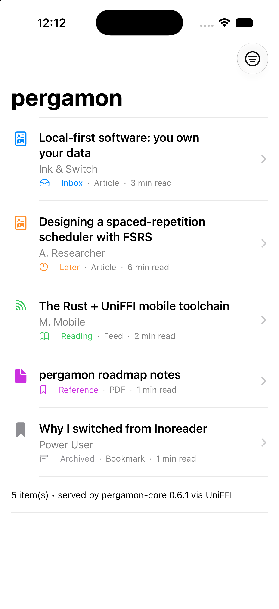

# Spike findings: UniFFI iOS sample app

**Issue:** [#29](https://github.com/kafkade/pergamon/issues/29) ·
**Status:** ✅ Validated ·
**Date:** 2026-06-25

## Verdict

The iOS path is **technically open**. `pergamon-core` compiles to
`aarch64-apple-ios` / `aarch64-apple-ios-sim`, UniFFI generates idiomatic Swift
bindings with no hand-written `unsafe` glue, and a SwiftUI app links the static
library and runs in the Simulator — listing and opening items that are built
entirely in Rust. Binary-size overhead is negligible (~0.5 MB stripped for the
whole app). The two friction points are both one-time setup costs, documented
below.



## What was built

| Artifact | Path | Notes |
|----------|------|-------|
| UniFFI facade crate | `crates/pergamon-uniffi/` | Narrow Apple-facing surface over `pergamon-core` |
| iOS build script | `scripts/build-ios.sh` | Rust → static libs → bindings → `PergamonFFI.xcframework` |
| Host smoke test | `scripts/smoke-macos.sh` + `apps/ios/HostSmoke/main.swift` | Fast inner-loop binding check, no Xcode |
| SwiftUI app | `apps/ios/` | xcodegen project + inbox list + detail (reader) views |

### Exposed surface (deliberately narrow)

UniFFI **proc-macro mode** (no `.udl` file): `#[uniffi::export]`,
`#[derive(uniffi::Record/Enum)]`, `uniffi::setup_scaffolding!()`.

- Records: `ContentItem`
- Enums: `ContentType`, `Status`
- Functions: `sampleItems()`, `itemsWithStatus(status:)`, `getItem(id:)`,
  `readingMinutes(text:)`, `libraryVersion()`

The facade serves an in-memory seeded corpus and exercises real core logic
(`reading_time_from_text`) and real core types (`Uuid`, `OffsetDateTime`,
`ContentType`, `DocumentStatus`) across the boundary. There is **no SQLite
binding** yet — storage on Apple is deferred to Phase 6 (ADR-020).

## Ergonomics

Overall: **good**. The generated Swift is clean and idiomatic; the round-trip
from a Rust `struct`/`enum` to a usable SwiftUI model required zero manual
bridging code.

### What worked well

- **Naming.** UniFFI lower-camelCases everything for Swift automatically:
  `sample_items` → `sampleItems()`, `published_at_millis` → `publishedAtMillis`,
  `FeedItem` → `.feedItem`. The Rust side stays idiomatic snake_case.
- **Free Swift conformances.** Generated records/enums come with `Equatable`,
  `Hashable`, and `Sendable`, so they drop straight into SwiftUI `List`,
  `ForEach`, and `navigationDestination(for:)` with only a one-line
  `extension ContentItem: Identifiable {}` added app-side.
- **Optionals & collections.** `Option<T>` → Swift optional, `Vec<T>` → Swift
  array — no wrappers, no sentinels.
- **No `.udl`.** Proc-macro mode keeps the contract in Rust where the types live;
  the bindings are a pure build artifact.
- **Vendored generator.** Shipping `uniffi-bindgen` as a crate `[[bin]]` pins the
  generator to the exact `uniffi` runtime version, eliminating version skew.

### Boundary type mapping

The facade owns these conversions so Swift never sees an awkward type:

| Core type | FFI type | Rationale |
|-----------|----------|-----------|
| `Uuid` | `String` | UUIDs aren't a UniFFI primitive; strings are trivial and stable |
| `OffsetDateTime` | `i64` (epoch millis) | Mapped to `Date` app-side in one line |
| `ContentType` / `DocumentStatus` | mirrored `enum` | Decouples the FFI ABI from internal enums |
| `Option<T>` | Swift optional | Native |

### Friction points (one-time costs)

1. **`unsafe_code = "forbid"` vs. UniFFI scaffolding.** The workspace lint
   forbids `unsafe`, but UniFFI's generated FFI glue emits it. The facade crate
   therefore **cannot** use `[lints] workspace = true`; it declares its own
   `[lints]` table that allows `unsafe_code` while keeping the rest strict. This
   is the right boundary anyway — `pergamon-core` keeps `forbid`, and only the
   thin FFI crate relaxes it.
2. **XCFramework module map naming.** UniFFI emits `pergamon_uniffiFFI.modulemap`,
   but an XCFramework's Clang module must be named `module.modulemap`. The build
   script renames it when staging headers. (Captured once in `build-ios.sh`.)

### Not yet exercised (call out for Phase 6 / ADR-019)

- **Error mapping.** No fallible functions were exposed. UniFFI maps
  `Result<T, E>` to Swift `throws` when `E` derives `uniffi::Error`; the core
  `CoreError` (`thiserror`) will need an FFI error enum. ADR-019 should define
  this mapping.
- **Stateful objects.** Only free functions + records were used. A real app needs
  a `#[uniffi::export]` object (e.g. a `Library` handle wrapping the DB) —
  straightforward in UniFFI but untested here.
- **Async.** Not exercised. UniFFI supports `async fn`; relevant once
  networking/sync is wrapped.
- **Threading.** Records are `Sendable`; object handles will need `Send + Sync`.

## Binary size

Measured on Apple Silicon, `--release` (`lto = "thin"`, `strip = "symbols"`,
`codegen-units = 1`), iOS device arch (`arm64`).

| Artifact | Size |
|----------|------|
| `libpergamon_uniffi.a` (per arch, static archive) | ~46 MB |
| `PergamonFFI.xcframework` (device + sim slices) | ~92 MB |
| **App bundle** (`PergamonSpike.app`, Release, device) | **792 KB** |
| App Mach-O binary (Swift + Rust core, linked) | 782 KB |
| App Mach-O binary, stripped | **525 KB** |

**Takeaway:** the multi-megabyte `.a`/xcframework numbers are misleading — a
static archive carries every object file plus metadata. The **linker dead-strips
everything unreferenced**, so the actual shipped binary including SwiftUI glue +
the Rust core + the UniFFI runtime is **~0.5 MB stripped**. Binary size is a
non-issue for a narrow facade, confirming the roadmap risk mitigation ("keep the
exposed surface area narrow and wrapper-friendly").

The on-disk xcframework size only affects the dev checkout, and it's git-ignored
and regenerated on demand.

## Reproduce

```sh
# Fast path — validate the bindings without Xcode:
./scripts/smoke-macos.sh

# Full path — build the iOS app:
./scripts/build-ios.sh
cd apps/ios && xcodegen generate
xcodebuild -project PergamonSpike.xcodeproj -scheme PergamonSpike \
  -destination 'platform=iOS Simulator,name=iPhone 17' build
```

See [`apps/ios/README.md`](../../apps/ios/README.md) for install/launch steps.

## Toolchain

Rust 1.96 · uniffi 0.29.5 · Xcode 26.5 (iOS 26.5 SDK) · Swift 6.3 · xcodegen.

## Recommendations

- **Adopt this structure for Phase 6.** `crates/pergamon-uniffi` as the only
  crate that relaxes the `unsafe` lint; `pergamon-core` stays zero-I/O and
  `forbid`-clean. Matches the roadmap's planned layout.
- **Write ADR-019** covering: proc-macro mode (no UDL), the `Uuid`/time mapping
  conventions, the `CoreError` → FFI error-enum mapping, and the object-handle
  pattern for the eventual SQLite-backed `Library`.
- **Keep the surface narrow.** Expose product-shaped records and a handful of
  handles, not internal crate types — this is what keeps both ergonomics and
  binary size healthy.
- **Commit the generator pin.** Keep `uniffi-bindgen` vendored as a crate bin so
  CI/devs never hit generator/runtime drift.
